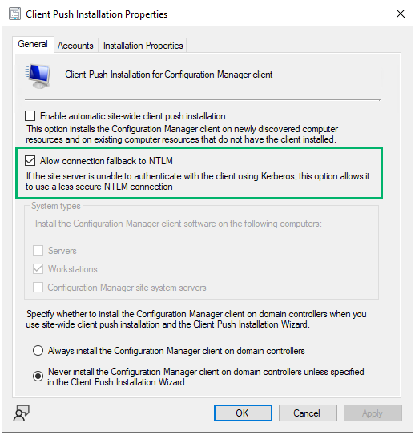

# PREVENT-1

## Description
Patch Site Server with KB15599094

## Summary

Within SCCM's client push installation properties, there exists a setting to "Allow connection fallback to NTLM" (Figure 1).

_Figure 1 - Client Push Installation Properties_

In SCCM versions prior to 2207, there exists a bug such that without this setting enabled, the connection will fallback to NTLM regardless of the setting. Microsoft patched this bug in [KB15599094](https://learn.microsoft.com/en-us/mem/configmgr/hotfix/2207/15599094). This patch is applied by default to new site installations of version 2207+.

This patch only applies to versions 2103+. If the installed version is older, Microsoft recommends updating to a current version.

## Linked Defensive IDs
- [PREVENT-2](../PREVENT-2/prevent-2_description.md)

## Associated Offensive IDs
- [ELEVATE-2: NTLM relay via automatic client push installation](../../../attack-techniques/ELEVATE/ELEVATE-2/ELEVATE-2_description.md)

## References
- Microsoft, NTLM client installation update for Microsoft Endpoint Configuration Manager, https://learn.microsoft.com/en-us/mem/configmgr/hotfix/2207/15599094
- Jitesh Kumar, SCCM Hotfix KB15599094 NTLM Client Installation Update, https://www.anoopcnair.com/sccm-hotfix-kb15599094-ntlm-client-installation/
- Brandon Colley, Push Comes To Shove: Bypassing Kerberos Authentication of SCCM Client Push Accounts, https://www.hub.trimarcsecurity.com/post/push-comes-to-shove-bypassing-kerberos-authentication-of-sccm-client-push-accounts