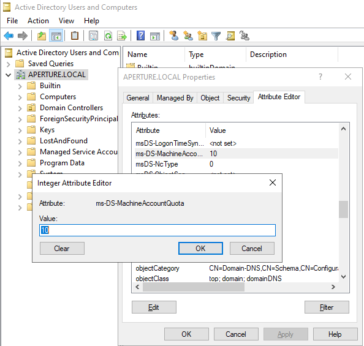
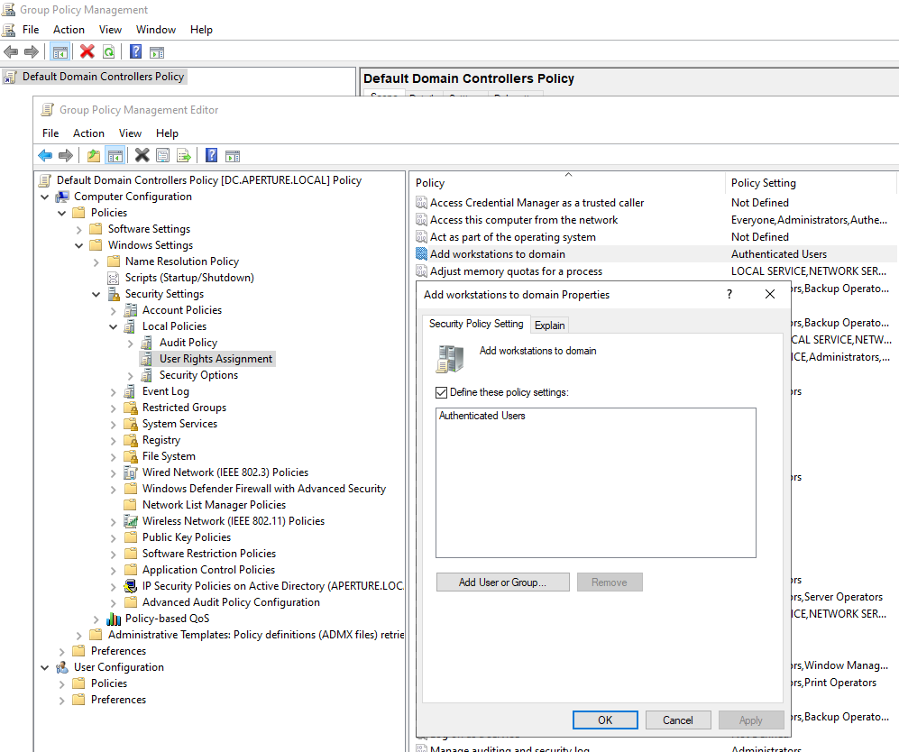

# PREVENT-16
## Description
Restrict machine account creation

## Summary
There are various attack techniques that rely on controlling an Active Directory computer account. This is a requirement to abuse Kerberos [resource-based constrained delegation](https://learn.microsoft.com/en-us/windows-server/security/kerberos/kerberos-constrained-delegation-overview), which can be combined with [TAKEOVER-8](../../../attack-techniques/TAKEOVER/TAKEOVER-8/takeover-8_description.md), as well as spoofing a computer to request the SCCM computer policy ([CRED-2](../../../attack-techniques/CRED/CRED-2/cred-2_description.md)).

In order to control a computer account, an attacker must escalate privileges on a computer or create a new computer account in Active Directory. By default, all domain users can create 10 computer accounts, thus presenting attackers with a trivial path of least resistance.

This default setting is controlled by the [ms-DS-MachineAccountQuota](https://learn.microsoft.com/en-us/windows/win32/adschema/a-ms-ds-machineaccountquota) attribute of the domain object. This attribute should be set to zero and more fine-grained policies should be established for accounts that require the ability to create computer objects, such as [delegation](https://4sysops.com/archives/delegate-permissions-for-domain-join/).

To modify this setting (Figure 1):

1. Open ADUC on a domain controller
2. Navigate to the domain
3. Right click on the domain and select "Properties"
4. Select the "Attribute Editor" tab
5. Find the `ms-DS-MachineAccountQuota` attribute
6. Set the attribute to `0`

_Figure 1: Modify `ms-DS-MachineAccountQuota in ADUC`_

The other method for restricting this capability is part of the `Default Domain Controllers Policy` group policy. By default, this policy grants `Authenticated Users` the `SeMachineAccountPrivilege`, which provides the ability to create machine accounts.

To modify this group policy (Figure 2):

1. Open Group Policy Management Editor
2. Navigate to `Default Domain Controllers Policy`
3. Right click and select "Edit"
4. Navigate to `Default Domain Controllers Policy > Computer Configuration > Policies > Windows Settings > Security Settings > Local Policies > User Rights Assignment`
5. Find the `Add workstations to domain` policy
6. Right click and select "Edit"
7. Remove `Authenticated Users`

**NOTE:** Attackers often find a `ms-DS-MachineAccountQuota` value of great than `0` but cannot create a machine account. It is due to this group policy being in a non-default state.

## Linked Defensive IDs
- N/A

## Associated Offensive IDs
- [CRED-2: Request computer policy and deobfuscate secrets](../../../attack-techniques/CRED/CRED-2/cred-2_description.md)
- [TAKEOVER-8: Hierarchy takeover via NTLM coercion and relay HTTP to LDAP on domain controller](../../../attack-techniques/TAKEOVER/TAKEOVER-8/takeover-8_description.md)

## References
- Microsoft, Kerberos Resource-Based Constrained Delegation Overview, https://learn.microsoft.com/en-us/windows-server/security/kerberos/kerberos-constrained-delegation-overview
- Elad Shamir, Wagging the Dog: Abusing Resource-Based Constrained Delegation to Attack Active Directory, https://eladshamir.com/2019/01/28/Wagging-the-Dog.html
- Wolfgang Sommergut, Delegate Permissiosn for Domain Join, https://4sysops.com/archives/delegate-permissions-for-domain-join/
- Microsoft, ms-DS-MachineAccountQuota, https://learn.microsoft.com/en-us/windows/win32/adschema/a-ms-ds-machineaccountquota
- Microsoft, Add workstations to domain, https://learn.microsoft.com/en-us/previous-versions/windows/it-pro/windows-10/security/threat-protection/security-policy-settings/add-workstations-to-domain

