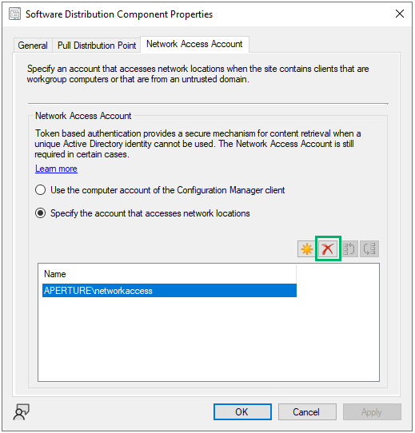

# Harden or Disable Network Access Account

## Code Name
PREVENT-3

## Summary
The [network access account](https://learn.microsoft.com/en-us/mem/configmgr/core/plan-design/hierarchy/accounts#network-access-account) (NAA) is a domain account that can be configured on the site server. Clients use the NAA to access and retrieve software from a distribution point but serves no other purpose on the client. The credentials are retrieved by clients as part of the Computer Policy. Upon receipt, the client will encrypt the NAA using the Data Protection API (DPAPI).

If the site is configured to use HTTPS or [Enhanced HTTP (eHTTP)](https://learn.microsoft.com/en-us/mem/configmgr/core/plan-design/hierarchy/enhanced-http) communication, the NAA is not needed to access the contents of a distribution point. Despite HTTPS or eHTTP being configured, we sometimes find the NAA configured as part of a site installation and long forgotten about. If this is your scenario, we (and Microsoft) recommend disabling the NAA entirely.

There exist several scenarios where the NAA is required, including HTTPS and eHTTP scenarios:
- [Multicast](https://learn.microsoft.com/en-us/mem/configmgr/osd/deploy-use/use-multicast-to-deploy-windows-over-the-network) is configured for operating system deployment.
- A task sequence is configured with the "Access content directly from a distribution point when needed by the running task sequence" [option](https://learn.microsoft.com/en-us/mem/configmgr/osd/deploy-use/deploy-a-task-sequence#bkmk_deploy-options).
- A task sequence fails to communicate with the state migration point using the device's computer account during the "[Request Store State](https://learn.microsoft.com/en-us/mem/configmgr/osd/understand/task-sequence-steps#BKMK_RequestStateStore)" step, the task sequence will fall back to the NAA.
- The "Apply OS image" step of a task sequence is configured to "Access content directly from the distribution point"
- A task sequence is configured with "Run another program first."
- Managing clients in untrusted domains and cross-forest trusts

If operating within one of the above scenarios, ensure the NAA is properly permissioned such that it cannot logon interactively and can only read the distribution point network share.

If none of the above scenarios pertain to the site in question, Microsoft recommends disabling the NAA in favor of using HTTPS or Enhanced HTTP communications for retrieving software from distribution points. The NAA configuration window is shown in Figure 1 with the "Remove" option highlighted.

_Figure 1 - Network access account configuration_

**NOTE:** When disabling or changing the NAA, it is paramount to disable the old account in Active Directory. This is explained in [PREVENT-15](../prevent-15/prevent-15_description.md).

## Linked Defensive IDs
- [PREVENT-4: Enable Enhanced HTTP](../PREVENT-4/prevent-4_description.md)
- [PREVENT-8: Require PKI certificates for client authentation](../prevent-8/prevent-8_description.md)
- [PREVENT-15: Disable legacy network access accounts in active directory](../prevent-15/prevent-15_description.md)

## Associated Offensive IDs
- [CRED-1: Retrieve secrets from PXE boot media](../../../attack-techniques/CRED/CRED-1/cred-1_description.md)
- [CRED-2: Request and deobfuscate machine policy to retrieve credential material](../../../attack-techniques/CRED/CRED-2/cred-2_description.md)
- [CRED-3: Dump network access account (NAA) credentials via WMI](../../../attack-techniques/CRED/CRED-3/cred-3_description.md)
- [CRED-4: Retrieve legacy network access account (NAA) credentials from the CIM Repository](../../../attack-techniques/CRED/CRED-4/cred-4_description.md)
- [CRED-5: Dump SCCM Credentials from Site Database](../../../attack-techniques/CRED/CRED-5/cred-5_description.md)

## References
- Microsoft, Network access account, https://learn.microsoft.com/en-us/mem/configmgr/core/plan-design/hierarchy/accounts#network-access-account
