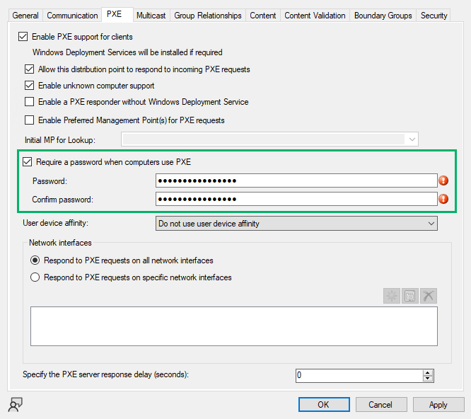

# PREVENT-6

## Description
Configure a strong PXE boot password

## Summary

PXE (Preboot eXecution Environment) boot passwords in ConfigMgr are a security feature to protect the PXE boot process from unauthorized access. When attempting to network boot from the PXE-enabled distribution point, the user must enter a password to access the boot media. The password is configured in the PXE settings for the distribution point (Figure 1).

_Figure 1 - Distribution Point PXE Settings_

This password can be retrieve using tools like [PXEThief](https://github.com/MWR-CyberSec/PXEThief) and [pxethiefy](https://github.com/csandker/pxethiefy) and subjected to offline password attacks. Therefore, it is paramount to choose a unique, strong password that can withstand cryptographic interrogation.

## Linked Defensive IDs
- [PREVENT-6: Configure a strong PXE boot password](../../../defense-techniques/PREVENT/PREVENT-6/prevent-6_description.md)
- [PREVENT-7: Disable command support in PXE boot configuration](../../../defense-techniques/PREVENT/PREVENT-7/prevent-7_description.md)
- [PREVENT-21: Restrict PXE boot to authorized VLANs](../../../defense-techniques/PREVENT/PREVENT-21/prevent-21_description.md)

## Associated Offensive IDs
- [CRED-1: Retrieve secrets from PXE boot media](../../../attack-techniques/CRED/CRED-1/cred-1_description.md)
- [ELEVATE-4: Distribution Point Takeover via PXE Boot Spoofing](../../../attack-techniques/ELEVATE/ELEVATE-4/ELEVATE-4_description.md)
- [ELEVATE-5: Distribution Point Takeover via OSD Media Recovery](../../../attack-techniques/ELEVATE/ELEVATE-5/ELEVATE-5_description.md)

## References
- Microsoft, [Understanding PXE Boot](https://learn.microsoft.com/en-us/troubleshoot/mem/configmgr/os-deployment/understand-pxe-boot)
- Christopher Panayi, [Identifying and Retrieving Credentials From SCCM/MECM Task Sequences](https://www.mwrcybersec.com/research_items/identifying-and-retrieving-credentials-from-sccm-mecm-task-sequences)
- Christopher Panayi, [Pulling Passwords Out of Configuration Manager](https://www.youtube.com/watch?v=Ly9goAud0gs)
- Christopher Panayi, [PXEThief](https://github.com/MWR-CyberSec/PXEThief)
- Christopher Panayi, [AES-128 ConfigMgr CryptDeriveKey Hashcat Module](https://github.com/MWR-CyberSec/configmgr-cryptderivekey-hashcat-module)
- Carsten Sandker, [pxethiefy](https://github.com/csandker/pxethiefy)