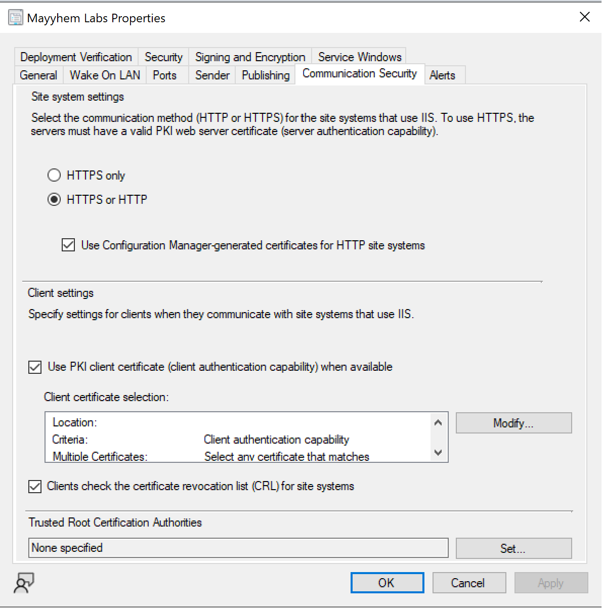

# PREVENT-8

## Description
Require PKI certificates for client authentation

## Summary
When PKI certificates are required for client authentication, the client must use a valid, trusted certificate to authenticate communications with management points. As a result, self-signed certificates created by an attacker can't be used to register rogue devices in SCCM to request policies or abuse automatic client push installation. This can allow recovery of plaintext domain credentials or coercion of NTLM authentication from configured installation accounts and the site server's domain computer account, which can be relayed to compromise other systems where the accounts have administrator privileges.

To begin planning the transition to requiring PKI certificates for client communications, follow [Plan for PKI certificates in Configuration Manager](https://learn.microsoft.com/en-us/mem/configmgr/core/plan-design/security/plan-for-certificates). You can view current settings at `Administration` > `Overview` > `Site Configuration` > `Sites` > `Properties` > `Communication Security`. Configure `HTTPS only` only after confirming that all clients in the environment are able to communicate with management points using PKI certificate.

_Figure 1 - Site PKI Settings_

## Linked Defensive IDs
- [PREVENT-4: Configure Enhanced HTTP](../PREVENT-4/prevent-4_description.md)

## Associated Offensive IDs
- [CRED-2: Request machine policy and deobfuscate secrets](../../../attack-techniques/CRED/CRED-2/cred-2_description.md)
- [ELEVATE-2: NTLM relay via automatic client push installation](../../../attack-techniques/ELEVATE/ELEVATE-2/elevate-2_description.md)

## References
- Chris Thompson, [Coercing NTLM Authentication from SCCM](https://posts.specterops.io/coercing-ntlm-authentication-from-sccm-e6e23ea8260a)
- Microsoft, [Plan for PKI certificates in Configuration Manager](https://learn.microsoft.com/en-us/mem/configmgr/core/plan-design/security/plan-for-certificates)